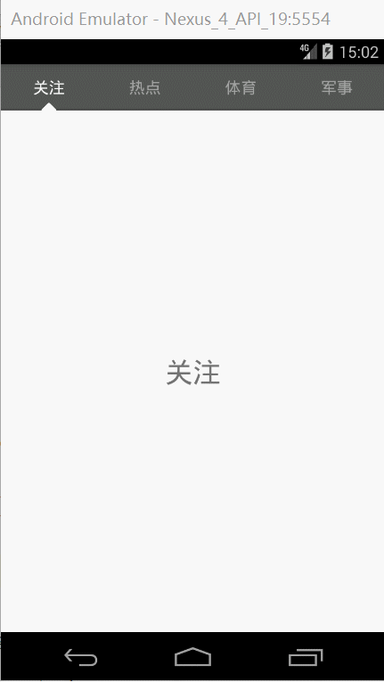

## ViewPagerIndicator

### 1、截图

电脑触摸板操作模拟器不方便，所以截图有卡顿效果，真机上没问题。

### 2、页面切换不经过中间页面

页面切换不经过中间页面，和今日头条效果一样，自定义ViewPager重写setCurrentItem方法，如果需要显示经过中间页面，改为true即可：

 	@Override
    public void setCurrentItem(int item) {
        super.setCurrentItem(item, false);
    }